# java_algorithm
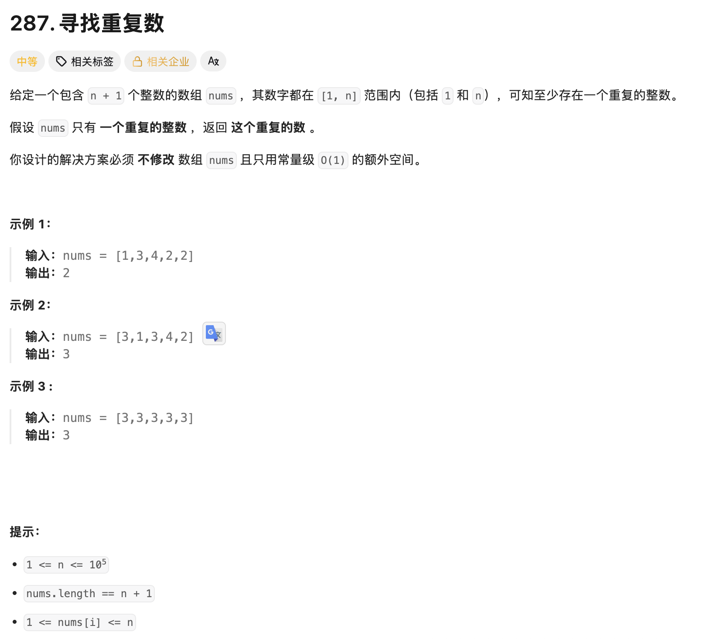
快慢指针法（Floyd 判圈算法）背后的数学推理建立在**链表中存在环**时两个指针的相遇性质上。我们来从数学的角度详细推导这个过程，并解释为什么它能找出“重复数字”。

---

## 🧩 1. 问题建模为链表找环

题目中给定数组：

* `nums` 长度为 `n+1`
* 元素取值范围是 `[1, n]`，因此根据 **鸽巢原理**，**至少有一个数字重复**
* 把每个下标 `i` 看成链表中的“节点”，值 `nums[i]` 视为“下一个节点指针”

于是我们得到了一个从 `0` 开始的伪链表结构：

```
0 → nums[0] → nums[nums[0]] → ...
```

这个结构必然 **形成一个环**，因为某个值会重复，意味着某两个节点指向同一个“下一个节点”。

---

## 🧠 2. Floyd 判圈法推理（快慢指针）

### 定义变量：

* `μ`：**环前长度**（从起点到环开始位置的距离）
* `λ`：**环长度**
* `x`：环开始的下标（重复数字）

---

### 第一步：相遇点推理

设：

* 慢指针一次走 1 步：`slow = slow + 1`
* 快指针一次走 2 步：`fast = fast + 2`

假设在第 `t` 次迭代时它们第一次相遇。

那么根据链表结构，我们可以写出：

* 慢指针走了 `t` 步
* 快指针走了 `2t` 步

两者相遇意味着快指针比慢指针多走了若干个**环的整圈长度**：

```
2t - t = kλ ⟹ t = kλ
```

即：**相遇时，慢指针刚好走了 k 个环长度（在环上）**

所以，无论从哪里进环，两个指针都会在环内相遇。

---

### 第二步：找环的起点（重复数）

**此时我们让 slow 回到起点 0，fast 留在相遇点**，然后两个指针都以 **每次一步**的速度前进，接下来它们将在环的入口（即重复数位置）再次相遇。

为什么呢？

* 原 slow 到环入口距离为：`μ`
* fast 在环内距离环入口的距离：因为 slow 走了 `t = kλ` 步，刚好处于环中 `t - μ` 的位置（模 λ）
* 所以，两者再次相遇时都刚好走了 `μ` 步，来到入口位置

即：

```
相遇点 → ... → 重复值（环入口）
   ↑               ↑
   fast          slow (从起点出发)
```

最终返回的就是环的入口，也就是重复数字本身。

---

## ✅ 数学关键总结

| 步骤    | 数学原理            | 结果       |
| ----- | --------------- | -------- |
| 相遇点存在 | 快慢指针步数差为环长度整数倍  | `t = kλ` |
| 再次相遇点 | 分别从头与相遇点出发，一步一走 | 相遇点为环入口  |
| 环入口含义 | 重复值即为环入口        | 找到重复数    |

---

## 🏁 总结

Floyd 判圈法通过如下关键数学特性保证算法正确性：

1. 环一定存在（因为存在重复值）；
2. 相遇点存在，且距离环入口固定；
3. 重新从起点与相遇点出发，以同速必定在环入口再次相遇。

这就是为什么 **不需要修改数组也能找到重复值**。
```java
 public int findDuplicate(int[] nums) {
        int slow = nums[0];
        int fast = nums[0];

        do{
            slow = nums[slow];
            fast = nums[nums[fast]];
        }while(slow != fast);

        if (nums[0] == slow) return slow;
        slow = nums[0];
        do{
            slow = nums[slow];
            fast = nums[fast];
        }while(slow != fast);

        return slow;
        
    }
```

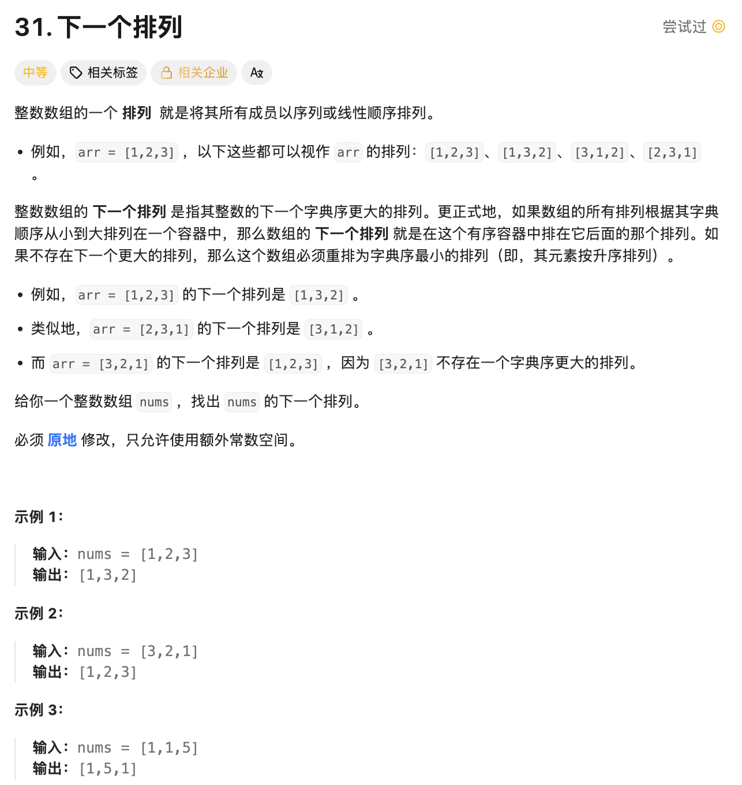
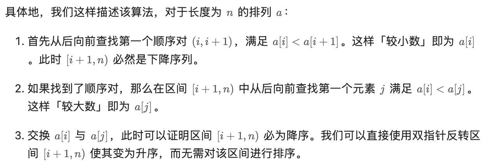

```java
public static void nextPermutation(int[] nums) {
        int i = nums.length - 1;
        while (i > 0 && nums[i - 1] >= nums[i]) {
            i--;
        }

        if(i > 0){
            int j = nums.length - 1;
            while (nums[i - 1] >= nums[j]) {
                j--;
            }

            int tempt = nums[j];
            nums[j] = nums[i - 1];
            nums[i - 1] = tempt;
        }

        Arrays.sort(nums, i, nums.length);
    }
```

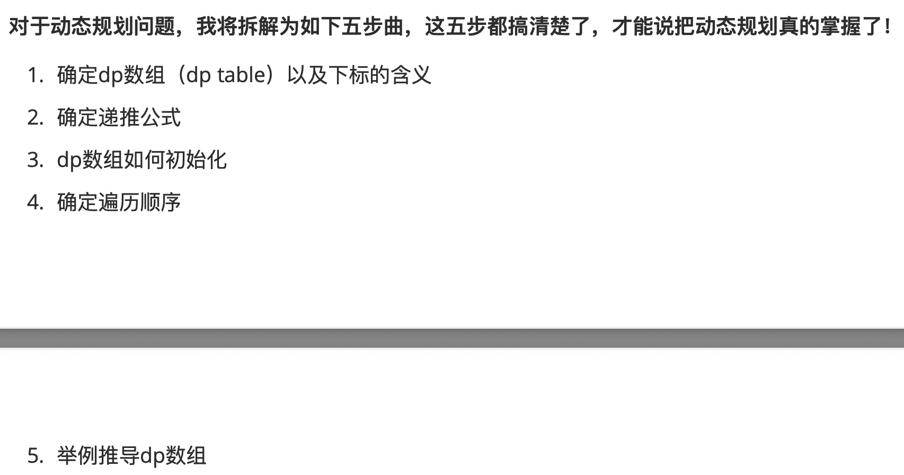

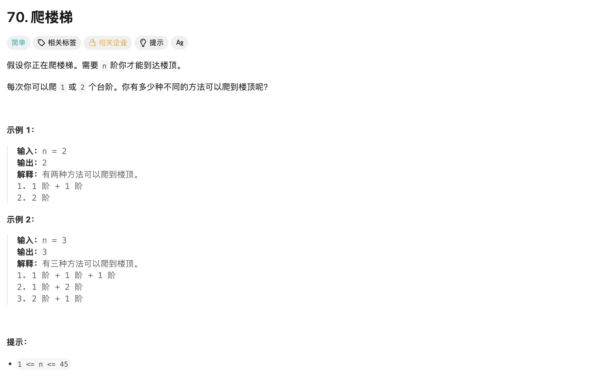
```java
public int climbStairs(int n) {
        int res[] = new int[n];
        res[0] = 1;
        res[1] = 2;

        for(int i = 2; i < n; i++){
            res[i] = res[i - 1] + res[i - 2];
        }

        return res[n-1];
    }
```

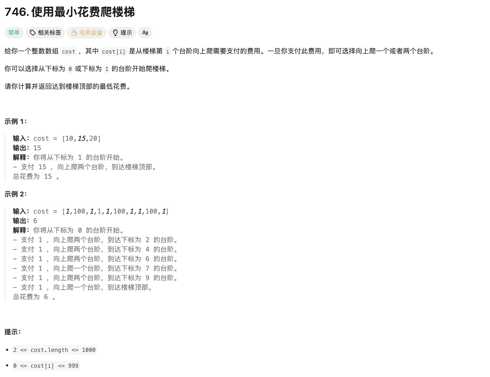
```java
public int minCostClimbingStairs(int[] cost) {
        if(cost.length == 1)return cost[0];

        int dp[] = new int[cost.length + 1];
        dp[0] = 0;
        dp[1] = 0;

        for(int i = 2; i < dp.length; i++){
            dp[i] = Math.min(dp[i - 1] + cost[i - 1], dp[i - 2] + cost[i - 2]);
        }
        return dp[dp.length - 1];
    }
```

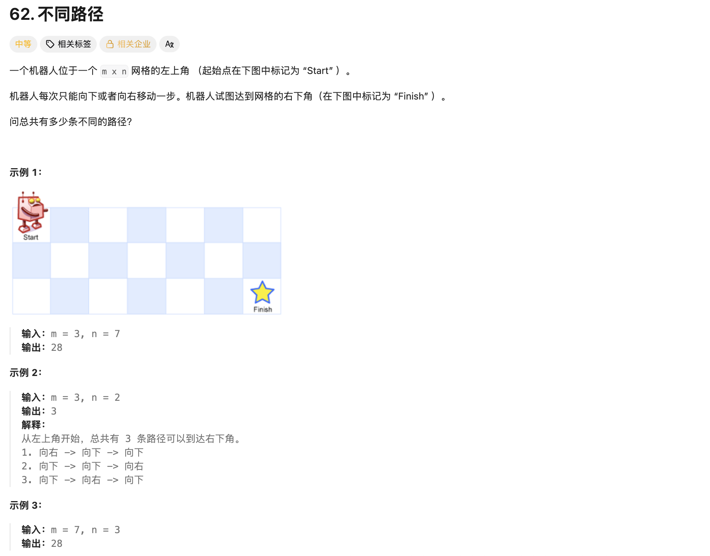
```java
public int uniquePaths(int m, int n) {

        if (m == 1) {
            return 1;
        }

        if (n == 1) {
            return 1;
        }

        int dp[][] = new int [m][n];
        for(int i = 0; i < n; i++){
            dp[0][i] = 1;
        }

        for(int i = 0; i < m; i++){
            dp[i][0] = 1;
        }

        for(int i = 1; i < m; i++){
            for(int j = 1; j < n; j++){
                dp[i][j] = dp[i - 1][j] + dp[i][j - 1];
            }
        }

        return dp[m - 1][n - 1];
    }
```

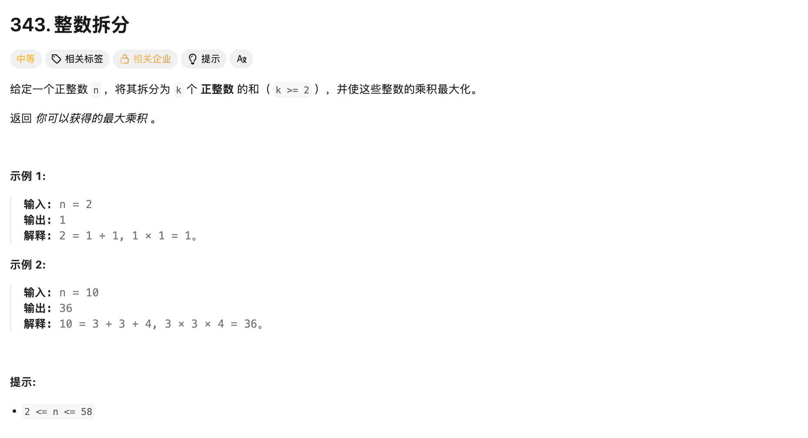
```java
public static int integerBreak(int n) {
        int dp[] = new int[n + 1];
        dp[0] = 0;
        dp[1] = 0;
        dp[2] = 1;
        
        for(int i = 3; i < n + 1; i++){
            for(int j = 1; j <= i/2; j++){
                dp[i] = max(j * (i - j), j * dp[i - j], dp[i]);
            }
        }

        return dp[n];
    }

    public static int max(int a0, int a1, int a2){
        if(a0 > a1){
            if(a0 > a2){
                return a0;
            }else{
                return a2;
            }
        }else{
            if(a1 > a2){
                return a1;
            }else{
                return a2;
            }
        }ß
    }
```

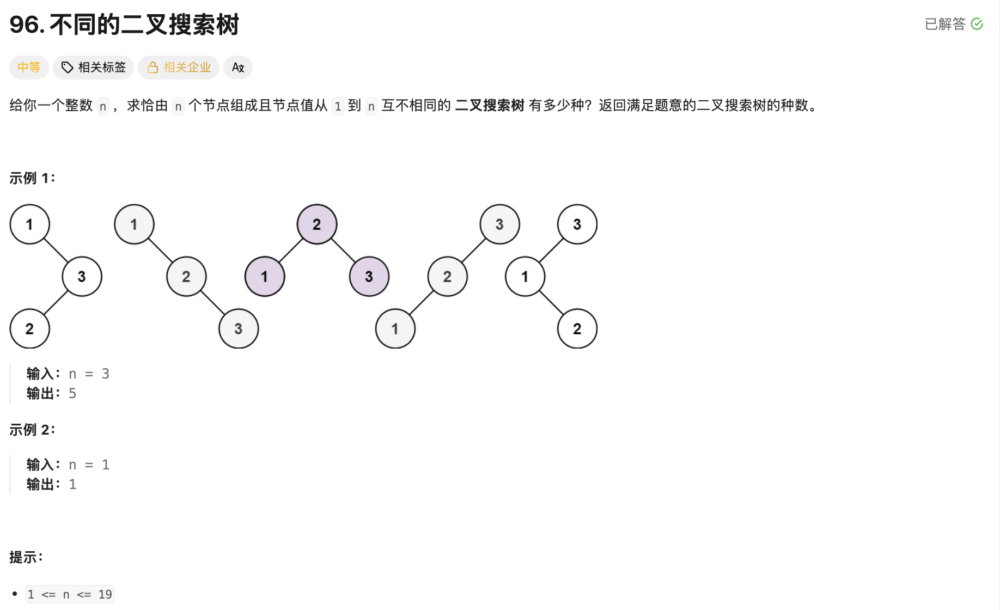
```java
public static int numTrees(int n) {
        int dp[] = new int[n + 1];
        dp[0] = 1;
        dp[1] = 1;
        if(n < 2) return 1;

        // dp[i]表示的是i整数的数组有多少种可能
        for(int i = 2; i < dp.length; i++){
            for(int j = 1; j <= i; j++){
                dp[i] += dp[j - 1] * dp[i - j];
            }
        }

        return dp[n];
    }
```

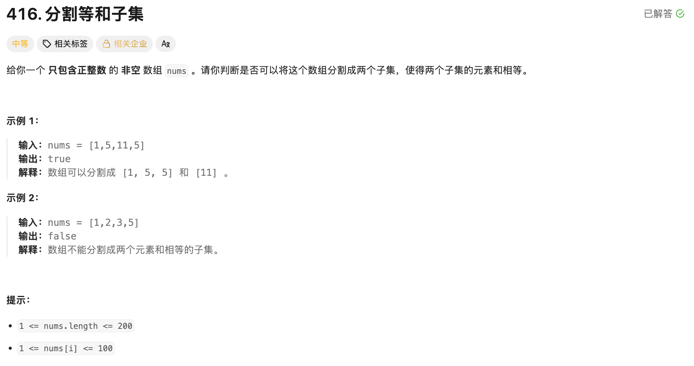
```java
public boolean canPartition(int[] nums) {
        int half = 0;
        for(int i = 0; i < nums.length; i++){
            half += nums[i];
        }
        if(half != half/2*2)return false;

        half = half / 2;
        int dp[] = new int[half + 1];

        // 如何转化为01背包问题，就是把i处的重量的东西只能一次地塞入背包里面去
        // 这个地方难点就是确定dp含义
        // dp[i] 的意思就是容量为i的时候最大的容量的最大价值就是dp[i]
        // dp[i] = max(dp[i], dp[i - nums[j]] + nums[j])
        // 初始化顺序，外层是考虑放入的一个接着一个的价值的东西
        // 初始化的话都是为0，然后就是开始往里面塞东西
        
        for(int i = 0; i < nums.length; i++){
            for(int j = half; j >= nums[i]; j--){
                dp[j] = Math.max(dp[j], dp[j - nums[i]] + nums[i]);
            }
        }

        if(dp[half] == half)return true;

        return false;
    }
```

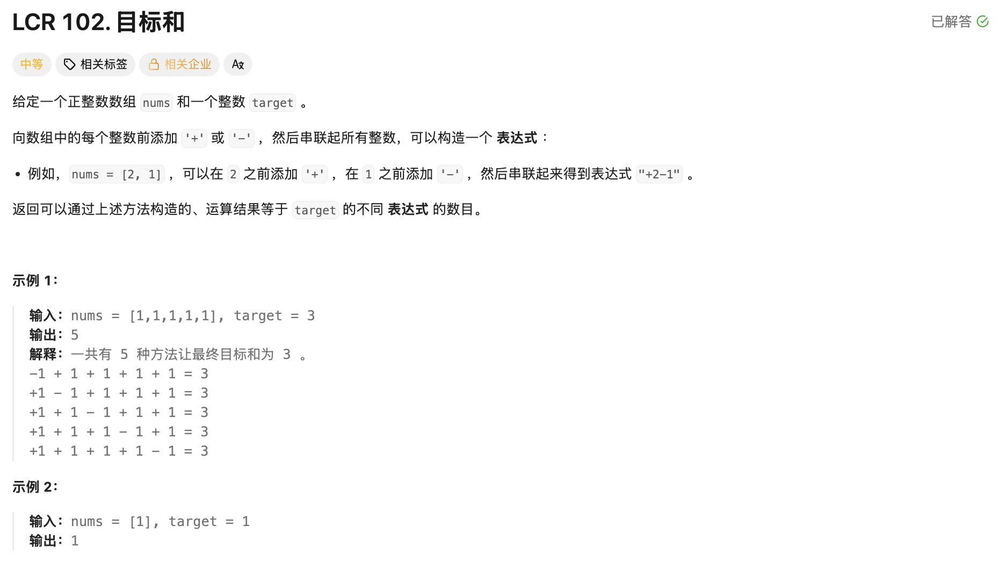
```java
public static int findTargetSumWays(int[] nums, int target) {
        int sum = 0;
        for(int i = 0; i < nums.length; i++){
            sum += nums[i];
        }
        if((sum + target) % 2 != 0) return 0;
        int left = (sum + target)/2;
        // left是需要装满的价值的，然后我现在需要做的是找装到这个量级的数量是多少
        // 构造dp数组，为dp[i]为装满i的价值的情况下是有dp[i]的数量的装法
        // 寻找递归方程式：dp[j] =dp[j] + dp[j - nums[i]]
        // 正序会导致重复的寻找导致问题

        
        
        int dp[] = new int[left + 1];
        dp[0] = 1;
        
        for(int j = 0; j < nums.length; j++){
            for(int i =  dp.length - 1; i >= nums[j]; i--){
                dp[i] += dp[i - nums[j]];
            }
        }

        return dp[left];
    }
```

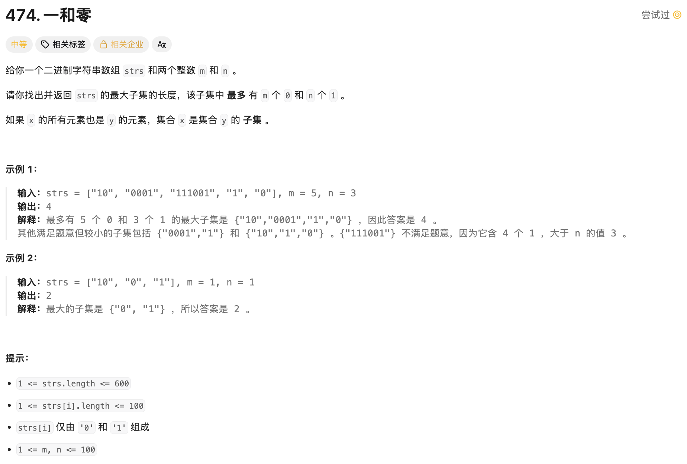

```java
public static int findMaxForm(String[] strs, int m, int n) {
        // dp[i][j]是指的i个零和j个一的情况下有多少个元素
        // dp[i][j] = max(dp[i][j], dp[i - x][j - y] + 1)
        // 初始化dp[i][j]初始化0这个理解到位了
        // 遍历顺序：倒着来，防止重复地去加这个一

        int dp[][] = new int[m + 1][n + 1];

        for (int k = 0; k < strs.length; k++) {
            int zeroNum = 0;
            int oneNum = 0;

            for(char tempt: strs[k].toCharArray()){
                if (tempt == '0') {
                    zeroNum++;
                }else{
                    oneNum++;
                }
            }
            if(zeroNum > m || oneNum > n)continue;

            for(int i = m; i >= zeroNum; i--){
                for(int j = n; j >= oneNum; j--){
                    dp[i][j] = Math.max(dp[i][j], dp[i - zeroNum][j - oneNum] + 1);
                }
            }
        }

        return dp[m][n];

    }
```


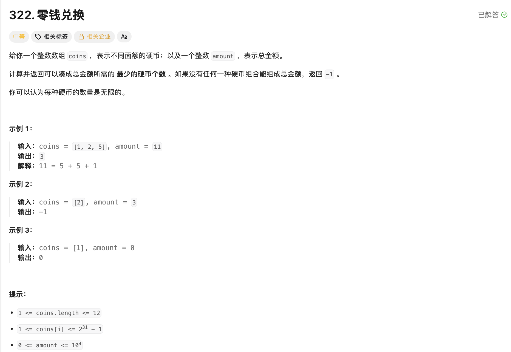
```java
public static int coinChange(int[] coins, int amount) {
        // dp[i] = min(dp[i], dp[i - coins[j]] + 1)
        //if(amount == 0)return 0;
        int dp[] = new int[amount + 1];

        for(int i = 1; i < dp.length; i++){
            dp[i] = amount + 1;
        }

        for(int i = 0; i < coins.length; i++){
            for(int j = coins[i]; j <= amount ; j++){
                dp[j] = Math.min(dp[j], dp[j - coins[i]] + 1);
            }
        }

       return dp[amount] > amount? -1: dp[amount];
    }
```

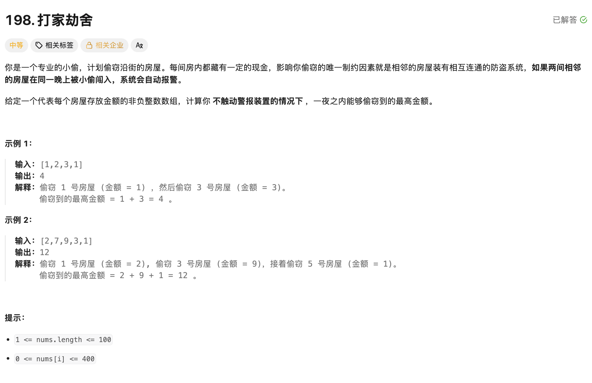
```java
    public static int rob(int[] nums) {
        int dp[] = new int[nums.length];
        if(nums.length == 1)return nums[0];
        if(nums.length == 2)return Math.max(nums[0], nums[1]);
        if(nums.length == 3)return Math.max(nums[1], nums[0] + nums[2]);
        dp[0] =nums[0];
        dp[1] = nums[1];
        

        for(int i = 3; i < nums.length; i++){
            dp[i] = Math.max(dp[i - 1], dp[i -2] + nums[i]);
            dp[i] = Math.max(dp[i], dp[i-3] + nums[i]);
        }

        return dp[nums.length - 1];
    }
```

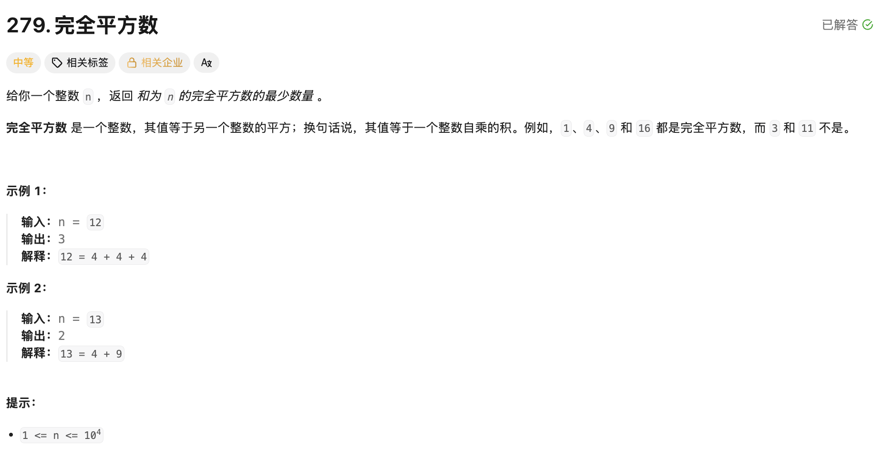

```java
public static int numSquares(int n) {
        //dp[i]是指的和为n的最少的平方和数dp[i]
        //dp[i] = min(dp[i - j^2], dp[i])
        int dp[] = new int[n + 1];
        for(int i = 0; i < dp.length; i++){
            dp[i] = i;
        }
        
        for(int i = 1; i*i < dp.length; i++){
            for(int j = i*i; j<= n; j++){
                dp[j] = Math.min(dp[j], dp[j - i*i] + 1);
            }
        }
        
        return dp[n];
    }
```
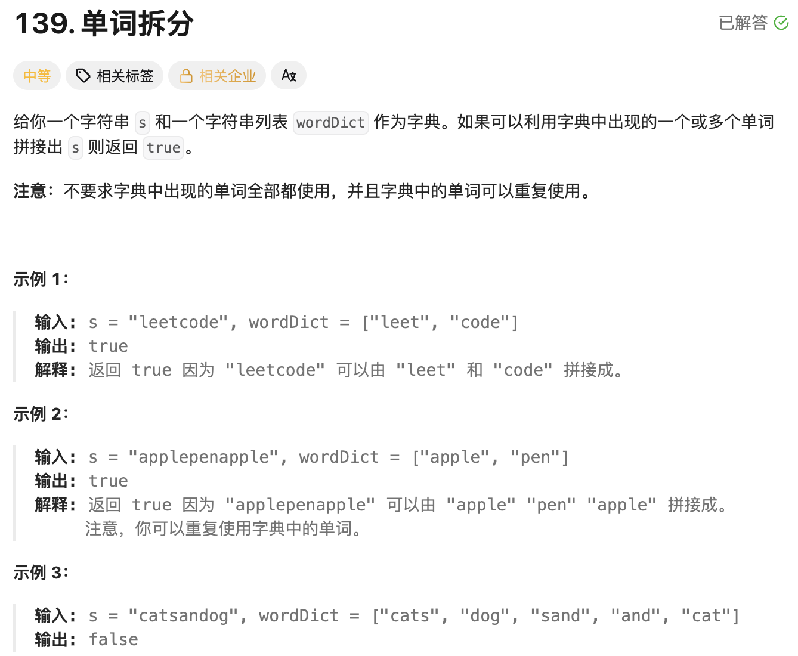

```java
    public boolean wordBreak(String s, List<String> wordDict) {
        //dp[i]代表i长度的是否是可以组成的
        boolean dp[] = new boolean[s.length() + 1];
        dp[0] = true;
        for(int i = 1; i <= s.length(); i++ ){
            for(int j = 0; j < i; j++){
                String tempt = s.substring(j, i);
                if(wordDict.contains(tempt) == true && dp[j] == true){
                    dp[i] = true;
                    break;
                }
            }
        }

        return dp[s.length()];
    }
```

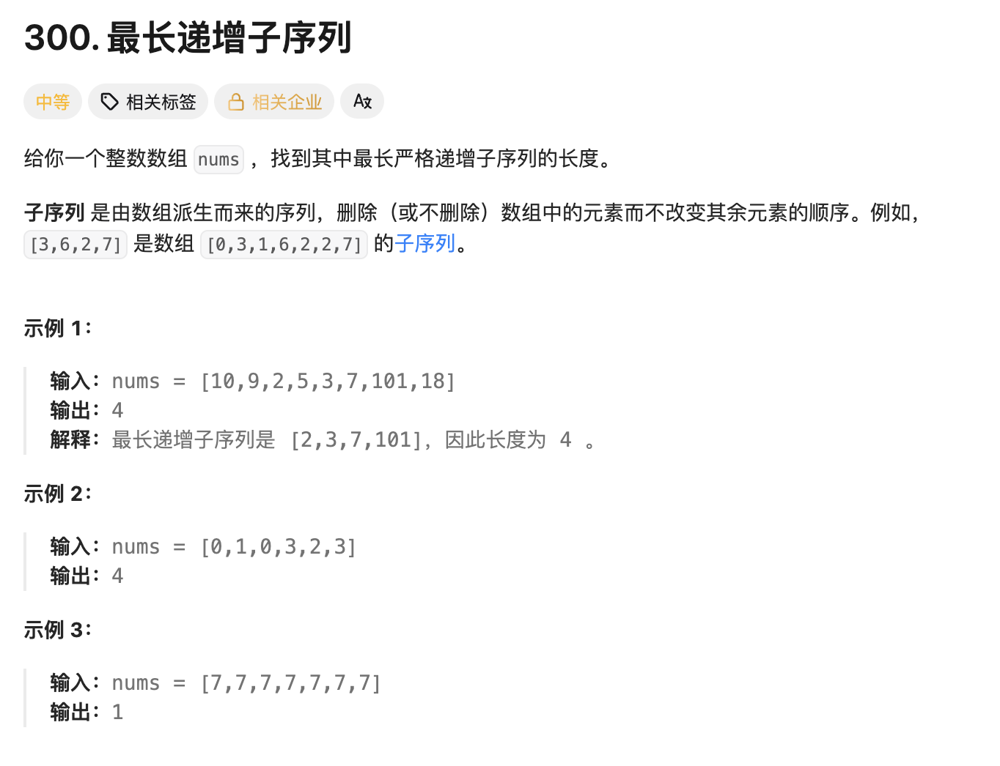
```java
public int lengthOfLIS(int[] nums) {
        // dp[i]代表的是num[i]为结尾的最长递归子序列的长度
        int dp[] = new int[nums.length];
        if(dp.length == 0)return 0;
        for(int i = 0; i < dp.length; i++){
            dp[i] = 1;
        }
        for(int i = 0; i < nums.length; i++){
            for(int j = i; j < nums.length; j++){
                if(nums[j] > nums[i]){
                    dp[j] = Math.max(dp[j], dp[i] + 1);
                }
            }
        }

        return Arrays.stream(dp).max().getAsInt();
        
    }
```